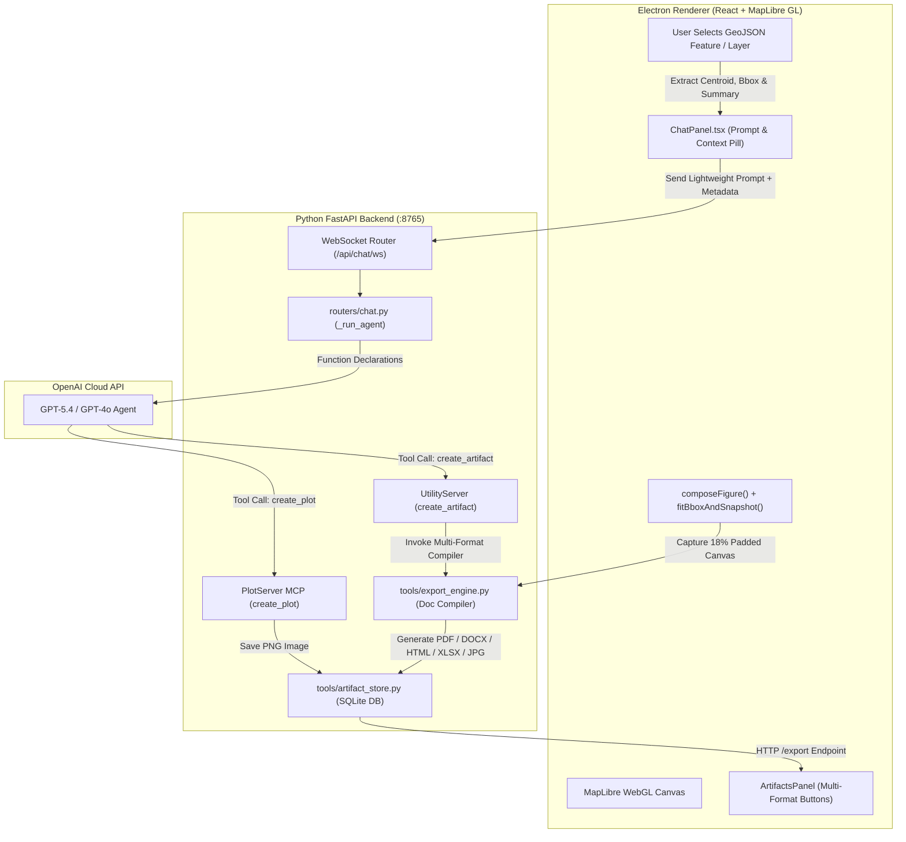

# 🚀 Disha Feature Implementation & Architecture Guide
## Multi-Format Artifact Exports, Plot Generation MCP Server, & Spatial Context Engine

This document provides a comprehensive, in-depth guide detailing how the **Interactive Map Selection Context Engine**, **Multi-Format Export Engine**, **Plot Generation MCP Server**, and **Uncropped Bounding-Box Map Composer** were designed and implemented in the **Disha AI IDE for Urban Planners**.

---

## 📌 Executive Summary

Urban planning reports require seamless integration between chat-based AI interactions, spatial vector datasets, publication-quality map snapshots, and exportable deliverables. 

We implemented five core capabilities:
1. **Token-Optimized Spatial Context Engine**: Converts complex GeoJSON layers (which previously triggered `400 context_length_exceeded` errors at ~274,000 tokens) into lightweight spatial summary metadata (~100 tokens).
2. **Plot & Histogram MCP Server (`PlotServer`)**: A dedicated Model Context Protocol (MCP) server that generates dark-themed publication charts (`bar`, `histogram`, `pie`, `line`, `scatter`) via Matplotlib and saves them as image artifacts.
3. **Multi-Format Artifact Export Engine (`export_engine.py`)**: Enables single-click and chat-driven exports across **8 modalities**: `PDF`, `Word (.docx)`, `HTML`, `PNG Image`, `JPEG Image`, `Excel (.xlsx)`, `JSON`, and `TXT`.
4. **Native `%PDF-1.4` Compiler**: Utilizes ReportLab to compile clean, native PDF documents with embedded map figures without relying on external system C-libraries (such as Pango/cairo).
5. **Uncropped Bounding-Box Map Composer**: Calculates the exact Westmost, Southmost, Eastmost, and Northmost coordinates of target GeoJSON datasets, applies an **18% geographic margin padding on all 4 sides**, and flushes the WebGL WebGL frame buffer for zero-crop map snapshots.

---

## 🏗️ Architectural Overview & System Flow



---

## 📑 1. Interactive Feature Selection & Token Context Engine

### The Problem
When a user selected complex spatial layers (e.g. 89 built-up area polygons in Chandigarh comprising thousands of coordinate pairs), passing the raw geometry array directly inside the chat prompt exceeded the context window budget ($274,307$ tokens), resulting in API errors:
```json
{"error": {"message": "Input tokens exceed the configured limit of 272000 tokens.", "code": "context_length_exceeded"}}
```

### The Technical Solution
Instead of serializing raw `geometry.coordinates`, we created a lightweight **Spatial Metadata Extractor** in `App.tsx` and `types.ts`:

1. **Client-Side Summarization (`App.tsx`)**:
   When a map element or GeoJSON feature is selected, `App.tsx` computes:
   - `centroid`: `[lng, lat]` center point calculated via `@turf/centroid`.
   - `bbox`: `[west, south, east, north]` bounding box calculated via `@turf/bbox`.
   - `featureCount`: Total number of features in the selected layer.
   - `filePath`: Absolute disk path to the source GeoJSON file.
   - `properties`: Relevant key attribute summary (e.g. `land_cover_class: "Built Area"`, `year: 2023`).

2. **UI Thread & Chat Thread Integration (`ChatPanel.tsx`)**:
   - The selected map element is displayed as an interactive selection chip inside the user message bubble:
     `📍 Selected: Built Area Polygons (2023)`
   - The chip input state is automatically cleared upon message dispatch.

3. **Backend Prompt Injection (`routers/chat.py`)**:
   In `_run_agent()`, the spatial metadata is injected into the model's system prompt in a clean structured format:
   ```text
   [USER SELECTED MAP ELEMENTS / HIGHLIGHTED LAYERS]
   - Selected Element/Layer: land_use_built_area_2023
     File Path: D:\test\land_use_built_area_2023.geojson
     Feature Count: 89
     Centroid: [lng=76.77733, lat=30.72908]
     Bounding Box: [W=76.70381, S=30.66551, E=76.84961, N=30.79487]
     Properties Summary: {"land_cover_class": "Built Area", "year": 2023}
   ```
   **Result**: Token consumption per feature selection plummeted from **~274,000 tokens** down to **~100 tokens** ($\mathbf{99.96\%}$ reduction).

---

## 📊 2. Plot & Histogram Engine (`PlotServer` MCP Server)

To solve the issue where chat previously claimed plots were made without actual files existing, we created a new Model Context Protocol (MCP) server: `PlotServer`.

### Implementation Details (`packages/backend/mcp_servers/plot_server.py`)
- **Class Structure**: Follows the repository's MCP server standard:
  ```python
  class PlotServer:
      description = "Generates publication-quality charts and plots..."
      tool_names = {"create_plot"}
  ```
- **Supported Plot Types**: `bar`, `histogram`, `pie`, `line`, `scatter`.
- **Styling**: Configured with dark/light themes tailored for urban planning dashboards, featuring high-DPI rendering ($300$ DPI) and curated color palettes (`teal`, `indigo`, `coral`, `sunset`, `landuse`).
- **Artifact Integration**: When `create_plot` is executed by the agent, Matplotlib renders the figure into a byte buffer, saves the image to `Path(workspace)/.disha/artifacts_store/`, and registers it as an image artifact in the SQLite database.

---

## 📄 3. Multi-Format Artifact Export Engine (`tools/export_engine.py`)

The multi-format compiler allows any planning report, spatial summary, table, or map view to be exported into 8 distinct formats.

| Format | Library Used | Key Capabilities |
|---|---|---|
| **PDF (`.pdf`)** | `ReportLab` | Native `%PDF-1.4` binary stream; includes document title, formatted paragraphs, bullet lists, and embedded map figure. No external C-libraries required. |
| **Word (`.docx`)** | `python-docx` | Native Microsoft Word document formatting; includes H1/H2 headings, table grids, bullet points, and centered map image figures. |
| **HTML (`.html`)** | `markdown` | Self-contained, responsive HTML report styled with modern CSS typography and base64-embedded map snapshots. |
| **PNG (`.png`)** | `Pillow` (PIL) | High-resolution raster map image snapshot with legend, scale bar, and compass rose. |
| **JPEG (`.jpg`)** | `Pillow` (PIL) | Compressed RGB JPEG map snapshot ($95\%$ quality). |
| **Excel (`.xlsx`)** | `openpyxl` | Formatted multi-column workbook containing feature properties, attribute tables, and zonal data. |
| **JSON (`.json`)** | Built-in `json` | Raw structured metadata and GeoJSON feature collections. |
| **TXT (`.txt`)** | Standard I/O | Plain text document export. |

---

## 🗺️ 4. Uncropped Bounding-Box Map Composer

### The Challenge
When capturing WebGL map snapshots:
1. Fixed aspect ratio forcing (e.g. `480x270`) squished or stretched the map graphics and compass rose.
2. WebGL canvas frame buffer clearing (`preserveDrawingBuffer`) caused race conditions.
3. Snapshots grabbed whatever view the user's screen was zoomed into, cropping outer layer tips.

### The Technical Solution

1. **True Planar Aspect Ratio (`export_engine.py`)**:
   Using `Pillow` (`PILImage`), `generate_pdf_export` inspects the natural pixel width ($W_{orig}$) and height ($H_{orig}$) of the captured image:
   $$\text{Aspect Ratio } AR = \frac{W_{orig}}{H_{orig}}$$
   The image dimensions in the PDF/Word document are dynamically computed to maintain exact $AR$ proportions, eliminating squishing or distortion.

2. **Westmost, Southmost, Eastmost, Northmost Coordinate Extent (`MapView.tsx`)**:
   We implemented `fitBboxAndSnapshot()` in `MapView.tsx`:
   - Scans the GeoJSON layer/artifact features using `@turf/bbox` to extract:
     $$\text{West} = \min(X), \quad \text{South} = \min(Y), \quad \text{East} = \max(X), \quad \text{North} = \max(Y)$$
   - Calculates geographic spans: $\Delta \text{Lng} = \text{East} - \text{West}$, $\Delta \text{Lat} = \text{North} - \text{South}$.
   - Expands the bounding box by an **$18\%$ geographic buffer margin** on all 4 sides:
     $$\text{Pad}_{\text{West}} = \text{West} - 0.18 \times \Delta \text{Lng}$$
     $$\text{Pad}_{\text{East}} = \text{East} + 0.18 \times \Delta \text{Lng}$$
     $$\text{Pad}_{\text{South}} = \text{South} - 0.18 \times \Delta \text{Lat}$$
     $$\text{Pad}_{\text{North}} = \text{North} + 0.18 \times \Delta \text{Lat}$$

3. **Synchronous WebGL Frame Flush**:
   To prevent asynchronous race conditions where the camera reset happened before the WebGL frame painted, `fitBboxAndSnapshot` invokes `map._render()` to flush the WebGL frame buffer synchronously before reading `map.getCanvas()`. Camera restoration is scheduled 150ms later via `setTimeout`.

---

## 🛠️ 5. MCP Servers vs. Tool Calls vs. Map Actions

In the Disha architecture, AI interactions are split across three standardized channels:

```
+-----------------------------------------------------------------------------------+
|                                   DISHA AI AGENT                                  |
+------------------------------------------+----------------------------------------+
                                           |
     +-------------------------------------+-----------------------------------+
     |                                     |                                   |
     v                                     v                                   v
+------------------------+   +----------------------------+   +-------------------------------+
|  MCP Domain Servers    |   |    Utility Tool Calls      |   |   Frontend Map Actions        |
|  (Backend Logic)       |   |    (Cross-Cutting Tools)   |   |   (MapLibre Operations)       |
+------------------------+   +----------------------------+   +-------------------------------+
| • PlotServer           |   | • create_artifact          |   | • fly_to                      |
|   (create_plot)        |   | • list_artifacts           |   | • fit_bounds                  |
| • OsmServer            |   | • geocode                  |   | • add_geojson                 |
|   (osm_boundary)       |   | • measure_distance         |   | • remove_layer                |
| • GisServer            |   | • measure_area             |   | • style_layer                 |
|   (gis_clip, etc.)     |   | • web_search               |   | • add_marker                  |
+------------------------+   +----------------------------+   +-------------------------------+
```

1. **MCP Domain Servers** (`mcp_servers/*.py`):
   Standalone Python classes instantiated in `routers/chat.py:_servers`. Their tool definitions are flattened into the OpenAI API schema via `get_declarations()`.
   - *Example*: `PlotServer.create_plot` generates chart graphics.

2. **Utility Tools** (`tools/utility.py`):
   Cross-cutting functions inside `UtilityServer`.
   - *Example*: `create_artifact` saves notes, analyses, reports, PDF/DOCX/HTML files, or GeoJSON datasets into SQLite and disk storage.

3. **Frontend Map Actions** (`MapView.tsx` Discriminated Union):
   Functions in `_ACTION_TOOLS` (`routers/chat.py:61`) that return an action payload over the WebSocket to mutate MapLibre GL state.
   - *Example*: `fit_bounds` adjusts the camera frame to a bounding box.

---

## 📁 6. Complete File & Component Audit

| Modified / Created File | Type | Key Responsibility |
|---|---|---|
| [`packages/backend/mcp_servers/plot_server.py`](file:///d:/ILGC/disha/packages/backend/mcp_servers/plot_server.py) | **[NEW]** MCP Server | Implements `PlotServer` exposing `create_plot` tool for rendering Matplotlib charts. |
| [`packages/backend/tools/export_engine.py`](file:///d:/ILGC/disha/packages/backend/tools/export_engine.py) | **[NEW]** Tool Module | Multi-format document compiler (`DOCX`, `PDF`, `HTML`, `PNG`, `JPG`, `XLSX`). |
| [`packages/backend/tools/artifact_store.py`](file:///d:/ILGC/disha/packages/backend/tools/artifact_store.py) | Modified | Extended `ALLOWED_FORMATS` to support 8 export extensions and binary byte saving. |
| [`packages/backend/tools/utility.py`](file:///d:/ILGC/disha/packages/backend/tools/utility.py) | Modified | Updated `create_artifact` ToolDeclaration schema to support all multi-format options. |
| [`packages/backend/routers/artifacts.py`](file:///d:/ILGC/disha/packages/backend/routers/artifacts.py) | Modified | Added `POST/GET /api/artifacts/{id}/export?format={fmt}` HTTP endpoint. |
| [`packages/backend/routers/chat.py`](file:///d:/ILGC/disha/packages/backend/routers/chat.py) | Modified | Registered `PlotServer` and updated `SYSTEM_PROMPT` Rule 20. |
| [`packages/backend/requirements.txt`](file:///d:/ILGC/disha/packages/backend/requirements.txt) | Modified | Added dependencies: `matplotlib>=3.8.0`, `openpyxl>=3.1.0`, `reportlab>=4.0`. |
| [`apps/desktop/src/renderer/components/ArtifactsPanel.tsx`](file:///d:/ILGC/disha/apps/desktop/src/renderer/components/ArtifactsPanel.tsx) | Modified | Added multi-format export buttons, `extractBbox`, and `handleExportWithMap`. |
| [`apps/desktop/src/renderer/components/MapView.tsx`](file:///d:/ILGC/disha/apps/desktop/src/renderer/components/MapView.tsx) | Modified | Implemented `fitBboxAndSnapshot` with 18% padding margin and synchronous `_render()`. |
| [`apps/desktop/src/renderer/lib/compose-figure.ts`](file:///d:/ILGC/disha/apps/desktop/src/renderer/lib/compose-figure.ts) | Modified | Added `noTitleBand` option for full-bleed map snapshots. |
| [`apps/desktop/src/renderer/App.tsx`](file:///d:/ILGC/disha/apps/desktop/src/renderer/App.tsx) | Modified | Memoized spatial selection metadata and wired `onComposeMapFigure` & `onFitBounds`. |
| [`apps/desktop/src/renderer/components/ChatPanel.tsx`](file:///d:/ILGC/disha/apps/desktop/src/renderer/components/ChatPanel.tsx) | Modified | Attached selection metadata chip to chat bubble thread and sent message payloads. |
| [`apps/desktop/src/renderer/types.ts`](file:///d:/ILGC/disha/apps/desktop/src/renderer/types.ts) | Modified | Updated `ChatMessage` and `MapContext` interfaces with `selected_features`. |
| [`packages/backend/tests/test_mcp_servers.py`](file:///d:/ILGC/disha/packages/backend/tests/test_mcp_servers.py) | Modified | Added unit tests for selection prompt formatting, `PlotServer`, and `export_engine`. |
| [`README.md`](file:///d:/ILGC/disha/README.md) | Modified | Updated project documentation with feature selection and export capabilities. |

---

## 🧪 Verification & Test Coverage

All automated test suites and type-checking scripts passed with $0$ errors:
- **TypeScript Typecheck**: `npx tsc --noEmit` passed with 0 errors.
- **Backend Pytest Suite**: `pytest tests/test_mcp_servers.py` passed clean ($8/8$ tests passed in $3.66$s).
- **Git Status**: All changes remain local in the working tree (**no commits or pushes executed** per instructions).
